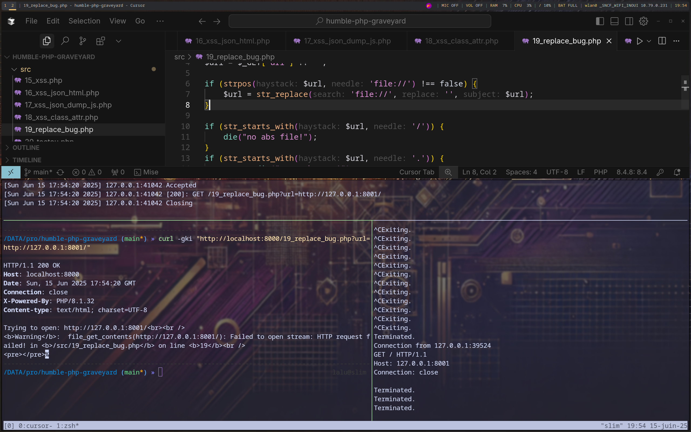

# Humble Php Graveyard

- This repository holds many bad code patterns for demo & training purpose 📖
- No writeup, No solution, Pure PHP Code to Clash'n'Trash 💣️
- Use it for free, Send Kudos, and remember to keep the ref/source 🙏

## How To Use

```bash
# Start the server
sudo docker run --rm -it -v ./src:/src -w /src --net=host --name php-graveyard php:8.1 php -S 127.0.0.1:8000
# Make yourself confy with a shell
sudo docker exec -it php-graveyard bash -il
# Setup a TCP listener for OutOfBounds vulns & tests
nc -lnvp 8001
while true; do timeout 1 nc -lnvp 8001; done
```

## Samples



```
drwxr-xr-x    - lalu 15 juin  19:35 src
.rw-r--r--  196 lalu 15 juin  19:38 ├── 01_file_read.php
.rw-r--r--  288 lalu 15 juin  19:43 ├── 02_ssrf.php
.rw-r--r--  138 lalu 15 juin  19:36 ├── 03_cmd.php
.rw-r--r--  497 lalu 15 juin  19:36 ├── 04_hard_cmd.php
.rw-r--r--  154 lalu 15 juin  19:36 ├── 05_eval.php
.rw-r--r--  191 lalu 15 juin  19:36 ├── 06_eval.php
.rw-r--r--  226 lalu 15 juin  19:36 ├── 07_type.php
.rw-r--r--  671 lalu 15 juin  19:36 ├── 08_hardv2_cmd.php
.rw-r--r--  272 lalu 15 juin  19:44 ├── 09_rce_typo.php
.rw-r--r--  711 lalu 15 juin  19:36 ├── 10_unserial_dual.php
.rw-r--r--  324 lalu 15 juin  19:36 ├── 11_twig.php
.rw-r--r--  621 lalu 15 juin  19:36 ├── 12_sqli.php
.rw-r--r--  781 lalu 15 juin  19:36 ├── 13_sqli_interpolation.php
.rw-r--r--  185 lalu 15 juin  19:36 ├── 14_file_read.php
.rw-r--r--  139 lalu 15 juin  19:36 ├── 15_xss.php
.rw-r--r--  136 lalu 15 juin  19:36 ├── 16_xss_json_html.php
.rw-r--r--  474 lalu 15 juin  19:36 ├── 17_xss_json_dump_js.php
.rw-r--r--  318 lalu 15 juin  19:36 ├── 18_xss_class_attr.php
.rw-r--r--  463 lalu 15 juin  19:45 ├── 19_replace_bug.php
.rw-r--r--  521 lalu 15 juin  19:45 ├── 20_toctou.php
.rw-r--r--  350 lalu 15 juin  19:36 ├── 21_path_traversal.php
.rw-r--r--  378 lalu 15 juin  19:36 ├── 22_dynamic_func.php
.rw-r--r--  488 lalu 15 juin  19:36 ├── 23_dynamic_class.php
.rw-r--r--  681 lalu 15 juin  19:36 ├── 24_file_upload.php
.rw-r--r-- 171k lalu 15 juin  19:29 └── osk.png
.rw-r--r--  619 lalu 15 juin  19:48 readme.md
```